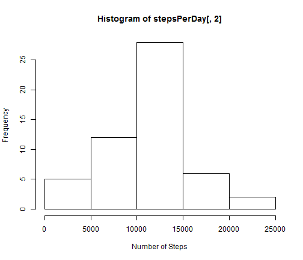
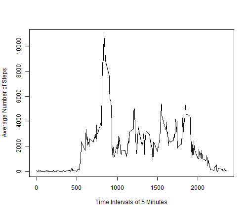
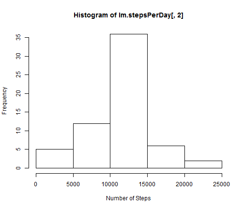

# Reproducible Research: Peer Assessment 1
This document explores data gathered from a personal activity monitoring device. 
## Loading and preprocessing the data
First, the data must be loaded, as shown below.I will be using the sqldf package in my analysis, and will also load that package.


```r
dataFile <- read.csv("~/RepData1/activity/activity.csv")
library(sqldf)
```

```
## Loading required package: gsubfn
## Loading required package: proto
## Loading required package: RSQLite
## Loading required package: DBI
## Loading required package: RSQLite.extfuns
```
Other than the presence of NAs, the data is relatively clean.
## What is mean total number of steps taken per day?
First, I break the number of steps down for each day, and make a histograph.


```r
stepsPerDay <- sqldf("SELECT date, SUM(steps) As NumberSteps FROM dataFile GROUP BY date")
```

```
## Loading required package: tcltk
```

```r
stepsPerDay[,2] <- as.numeric(stepsPerDay[,2])

hist(stepsPerDay[,2], xlab = "Number of Steps")
```

 

```r
meanStepsPerDay <- mean(na.omit(stepsPerDay[,2]))
medianStepsPerDay <- median(na.omit(stepsPerDay[,2]))
```
The mean steps taken per day were 1.0766 &times; 10<sup>4</sup>.
The median steps taken per day were 1.0765 &times; 10<sup>4</sup>.
## What is the average daily activity pattern?
Next, I look at the data across days, grouping by each 5 minute time interval.
The average number of steps is shown.

```r
stepsPerTime <- sqldf("SELECT interval, SUM(steps) AS NumberSteps FROM dataFile GROUP BY interval")
stepsPerTime[,2] <- as.numeric(stepsPerTime[,2])

plot(stepsPerTime[,1], stepsPerTime[,2], type = "l", xlab = "Time Intervals of 5 Minutes", ylab = "Average Number of Steps")
```

 

```r
maxStepsPerTime <- max(stepsPerTime[,2])
maxInterval <- stepsPerTime[stepsPerTime$NumberSteps == maxStepsPerTime, 1]
```
Of all of these intervals, 835 had the most, with an average of 1.0927 &times; 10<sup>4</sup>.
## Imputing missing values
As mentioned at the beginning, there are some NA values which need to be addressed.

```r
missingRows <- dataFile[!complete.cases(dataFile),]
countMissing <- nrow(missingRows)
```
There are 2304 rows with missing values for the number of steps.
These values will be replaced by the average for that time interval.

```r
imputedData <- dataFile
meanStepsPerTime <- sqldf("SELECT interval, AVG(steps) AS AvgSteps FROM dataFile GROUP BY interval")

for (i in 1:nrow(imputedData)){
  if (is.na(imputedData[i,1])){
    thisInterval <- imputedData[i,3]
    imputedData[i,1] <- meanStepsPerTime[meanStepsPerTime$interval == thisInterval,2]
  }
}

Im.stepsPerDay <- sqldf("SELECT date, SUM(steps) As NumberSteps FROM imputedData GROUP BY date")
Im.stepsPerDay[,2] <- as.numeric(Im.stepsPerDay[,2])

hist(Im.stepsPerDay[,2], xlab = "Number of Steps")
```

 

```r
Im.meanStepsPerDay <- mean(Im.stepsPerDay[,2])
Im.medianStepsPerDay <- median(Im.stepsPerDay[,2])
```
The original mean was 1.0766 &times; 10<sup>4</sup>. With the imputed values, it is 1.0766 &times; 10<sup>4</sup>.
The mean stays the same, which makes sense given that is how the imputations were done.
The original median was 1.0765 &times; 10<sup>4</sup>. With the imputed values, it is 1.0766 &times; 10<sup>4</sup>.
The median, on the other hand, changes. Before, the median was slightly lower.
With new data points at the mean, this necessarily drags the median up.
## Are there differences in activity patterns between weekdays and weekends?

```r
imputedData$date <- as.Date(imputedData$date)
imputedData$weekDay <- weekdays(imputedData$date)
imputedData$weekFactor <- "weekday"
imputedData[imputedData$weekDay == "Saturday" | imputedData$weekDay == "Sunday",5] <- "weekend"

par(mfrow = c(2,1))
Im.stepsPerTime <- sqldf("SELECT interval, SUM(steps) AS NumberSteps FROM imputedData GROUP BY interval, weekFactor")
Im.stepsPerTime[,3] <- as.numeric(Im.stepsPerTime[,3])
```

```
## Error: undefined columns selected
```

```r
plot(Im.stepsPerTime[Im.stepsPerTime$weekFactor == "weekend",1], Im.stepsPerTime[stepsPerTime$weekFactor == "weekend",3], type = "l", xlab = "Time Intervals of 5 Minutes", ylab = "Average Number of Steps", main = "weekend")
```

```
## Warning: no non-missing arguments to min; returning Inf
## Warning: no non-missing arguments to max; returning -Inf
## Warning: no non-missing arguments to min; returning Inf
## Warning: no non-missing arguments to max; returning -Inf
```

```
## Error: need finite 'xlim' values
```

```r
plot(Im.stepsPerTime[Im.stepsPerTime$weekFactor == "weekday",1], Im.stepsPerTime[stepsPerTime$weekFactor == "weekday",3], type = "l", xlab = "Time Intervals of 5 Minutes", ylab = "Average Number of Steps", main = "weekday")
```

```
## Warning: no non-missing arguments to min; returning Inf
## Warning: no non-missing arguments to max; returning -Inf
## Warning: no non-missing arguments to min; returning Inf
## Warning: no non-missing arguments to max; returning -Inf
```

```
## Error: need finite 'xlim' values
```

 

